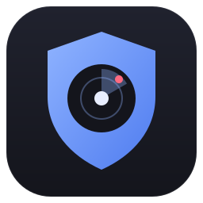
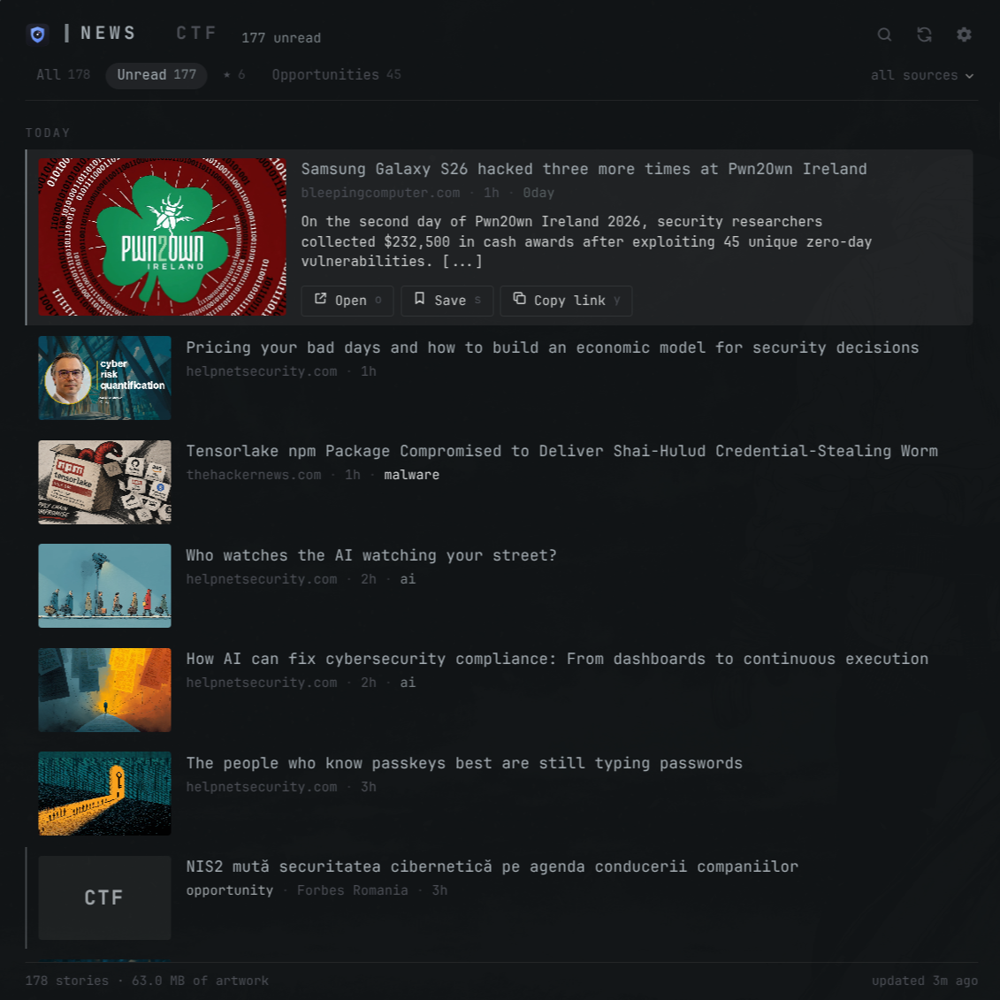
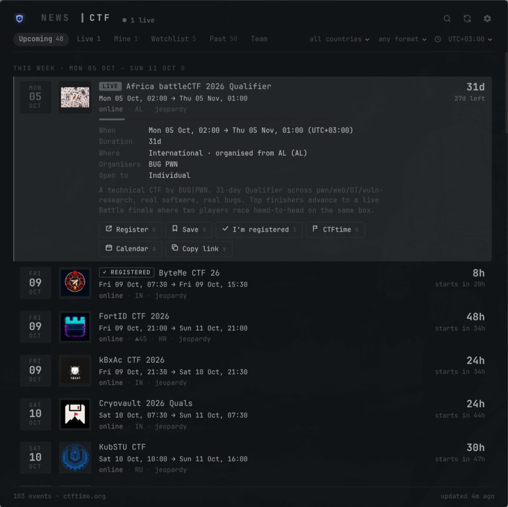
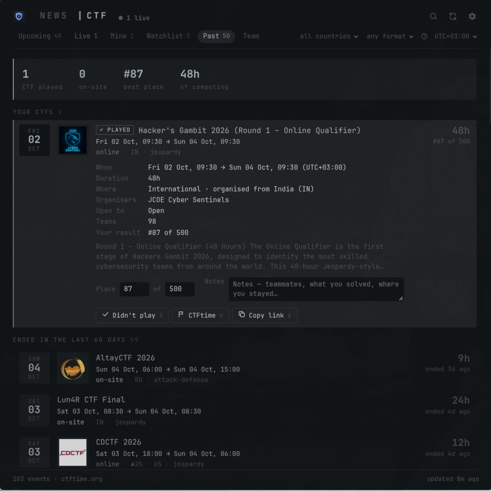

<p align="center"></p>

# pwnwatch

Cybersecurity news, every upcoming CTF and your own CTF history in one small Linux app, made for
[Omarchy](https://omarchy.org). On Omarchy it takes its colours and font from your current theme and
re-themes live when you switch; on any other distro it just works with a default dark theme.

| News | CTF | Past |
| --- | --- | --- |
|  |  |  |


## News

The last 7 days from The Hacker News, BleepingComputer, The Record, Krebs on Security, SecurityWeek,
Dark Reading, Help Net Security, DataBreaches.net and CISA.

- **Layout.** Stories are grouped by day, each with a thumbnail (the feed's image or the article's `og:image`) and auto-tags (`ransom`, `0day`, `breach`, `arrest`, `apt`, `cve`…).
- **Sources.** Filter by source from the dropdown. Add or remove your own RSS/Atom feeds in settings. They get the same thumbnails and tags as the built-in ones.
- **Opportunities.** Competitions, CTFs and scholarships, including ones the security sites never write about. This tab collects:
  - stories from news searches you can edit (Google News, English and Romanian by default)
  - CTFs that **just appeared on CTFtime**
  - hand-picked events (Bitdefender's CTF, DefCamp…) once they're within 45 days
- **Watch words.** Stories that mention your watch words (Romania, Bitdefender, DNSC…) get a ★.
- **Saving.** Save stories for later.

## CTF

Everything [CTFtime](https://ctftime.org) lists, plus big events it doesn't (DEF CON, DefCamp, Bitdefender's Grand Prix, OSC…).

| Tab | What's in it |
| --- | --- |
| **Upcoming** | This week · next 4 weeks · big events further out |
| **Live** | CTFs running right now, in red, with time left and a progress bar |
| **Mine** | CTFs you saved (`s`) or registered for (`i`) |
| **Watchlist** | Recurring competitions whose dates aren't out yet (OSC, UNbreakable, RoCSC, ECSC…) |
| **Past** | Your CTF history plus everything that ended in the last 60 days |
| **Team** | Your CTFtime team, recent results, and the leaderboard of any country |

Every CTF row shows:
- the date, the logo (when CTFtime has one) and the exact start → end time in your time zone
- **how long it runs** (`8h`, `48h`, `3 days`) next to a countdown
- online / on-site, CTFtime weight, country (★ if it's yours) and format

The full CTF list always includes every country. The **country** dropdown narrows it, for example to `GB` or
`IT`, and *home country* in settings decides which events get a ★ and which leaderboard you see first.
For online CTFs the country is the organising team's.

### Your CTF history

Mark a CTF with `i` (I'm registered). When it ends, it moves to **Past** under *Your CTFs*:
- If your CTFtime team is set, your place comes from CTFtime automatically. You can also type it in yourself.
- Each played CTF has a notes field for teammates, what you solved and where you stayed.
- On top you get the totals: CTFs played, on-site, best place, hours competing, and the cities you've been to.
- Past CTFs you didn't mark can be added with *I played this*.

## Install

**One line** (any Linux with `git`; uses `uv` or `pipx`):

```bash
curl -fsSL https://raw.githubusercontent.com/Anthony693Gab/pwnwatch/main/get.sh | bash
```

**Arch / Omarchy (AUR):**

```bash
yay -S pwnwatch
systemctl --user enable --now pwnwatch-digest.timer   # optional daily notification
```

**From a clone:**

```bash
git clone https://github.com/Anthony693Gab/pwnwatch && cd pwnwatch && ./install.sh   # --no-timer to skip the 09:00 notification
```

The installer:
- adds pwnwatch with its icon to the app launcher (`Super + Space`)
- enables a daily 09:00 notification
- removes the bar icon/panel that versions 0.3–0.4 added

Uninstall with `./install.sh --uninstall` (or `yay -R pwnwatch`). Your settings, history and cache are kept.

### Not on Omarchy?

pwnwatch works on any Linux. **It is a normal app, not an Omarchy plugin.** On Omarchy:
- it picks up your theme and font and follows `omarchy-theme-set` live
- it opens like Omarchy's built-in web apps

Elsewhere:
- it uses the Tokyo Night palette and your system monospace font
- it opens in Chromium, Chrome, Brave or Edge in app mode, or as a browser tab if none is installed

The daily notification needs `notify-send` (libnotify); everything else is plain Python ≥ 3.11 with no dependencies.

Want a key for it on Hyprland? Add to `~/.config/hypr/bindings.lua`:

```lua
o.bind("SUPER + SHIFT + X", "pwnwatch", "pwnwatch")
```

## Keys

| key | action |
| --- | --- |
| `1` `2` / `tab` | News / CTF |
| `h` `l` / `←` `→` | previous / next tab within News or CTF |
| `j` `k` / `↓` `↑` | move · `g` `G` top / bottom |
| `enter` / `o` | open the story / the CTF's registration page |
| `s` | save (story or CTF) |
| `i` | I'm registered / I played this |
| `c` · `a` · `y` | CTFtime page · add to calendar · copy link |
| `t` · `L` · `p` | Team · Live · Past |
| `/` | search |
| `m` · `r` · `,` | mark all read · refresh · settings |

## Command line

```bash
pwnwatch                  # open the app (or focus it)
pwnwatch digest [--print] # the daily notification, now
pwnwatch week             # this week's CTFs as plain text
pwnwatch news             # latest headlines as plain text
pwnwatch refresh          # fetch now
pwnwatch cleanup          # remove bar integrations left by 0.3/0.4
pwnwatch serve            # run the backend in the foreground (debugging)
```

## Configuration

Most things live in the settings panel (`,`). `~/.config/pwnwatch/config.toml` adds your own events:

```toml
home_country = "RO"
ctftime_team_id = 12345
timezone = "UTC+03:00"          # empty = system time
opportunity_queries = ['"capture the flag" competition', 'ro:concurs securitate cibernetică']

[[events]]
name    = "My university CTF"
start   = 2026-12-05
end     = 2026-12-06
mode    = "onsite"              # online | onsite | hybrid
country = "RO"
url     = "https://example.com/register"
```

## How it works

`pwnwatch` starts a small standard-library Python backend on `127.0.0.1` and shows a plain HTML/CSS/JS page
in an app window. The backend exits a few minutes after the window closes.

- **Theme.** Read from `~/.local/state/omarchy/current/theme/colors.toml`; it updates live when you run `omarchy-theme-set`.
- **Data.** Cache in `~/.cache/pwnwatch`. Read/saved state, your CTFs (`mine.json`) and settings in `~/.local/state/pwnwatch`.
- **Security.**
  - The backend answers only localhost `Host`s.
  - Writes are JSON-only.
  - The page runs under a strict CSP, and feed text is never inserted as HTML.
  - The image proxy refuses private addresses and SVGs.
  - Only links pwnwatch itself listed get opened.

## Data sources

- CTFs: the [CTFtime API](https://ctftime.org/api/). This is a personal client that links back to CTFtime; please don't turn it into a public mirror. CTFtime has no API keys, so your public team ID is all it needs.
- Opportunities: Google News search RSS, plus CTFtime.
- Hand-picked events: [`src/pwnwatch/events.py`](src/pwnwatch/events.py). PRs with new dates are the most useful contribution.

## Contributing

See [CONTRIBUTING.md](CONTRIBUTING.md). New event dates in `events.py` are always welcome.

## Development

```bash
pip install -e '.[dev]' && pytest
pwnwatch serve --keep-alive   # then open http://127.0.0.1:47431/
```

## License

MIT
